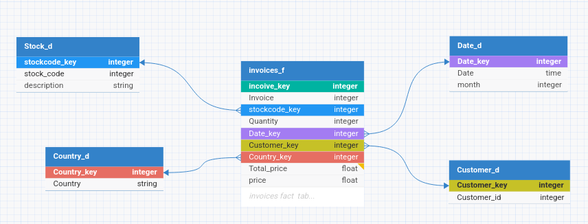

## Btsn_test
### Project composition
#### - Database init script :

-  sql definition of the proposed datawarehouse model using mssql: database/db_init/invoice_db_init.sql

#### - Data processor script :

 - using python, mainly pandas dataframes and sqlalchmy : data_processor/data_processor.py

#### - Logging module
#### - Docker compose deployment

>[!Important]
>Extra information on the assignment are on the notes file

### Data Model

### Prerequisites

    Docker
    Docker Compose
    Python

### Setup

#### Clone the Repository

`git clone https://github.com/shodayme/btsn_test.git`

`cd btsn_test`

>[!Important]
>The ownership of the "database" directory needs to be given to db_user
>
>`chown 10001:10001 database`
>
>The user running docker must be able to access the directory. For the sake of simplicty:
>
>`sudo chmod -R 777 database`
#### build the docker images

`docker compose build`

### Usage

#### start the database container

`docker compose up mssql_db -d`

#### run the etl

>[!Note]
>The db will take around 40 seconds to initialize

`docker compose run data_processor`

#### alternatively run both services

`docker compose up -d`
